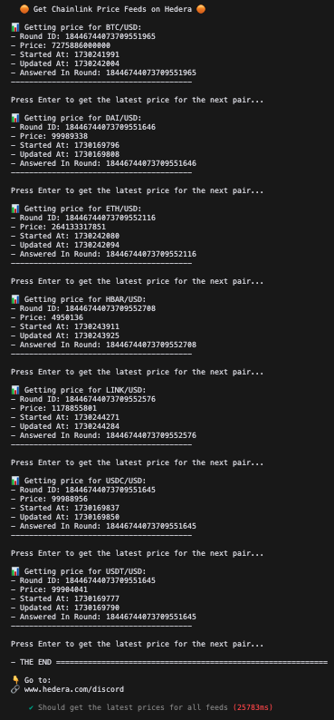

# Get Chainlink Price Feeds on Hedera

This repository shows how to get Chainlink price feeds on Hedera using the Chainlink Price Feeds Adapter.

## Try It in Gitpod

[](https://gitpod.io/?autostart=true#https://github.com/ed-marquez/hedera-example-chainlink-price-feeds)

1. Enter your Hedera testnet credentials in the `.env` file
2. Run the test to get the latest prices for all the price feeds:

   ```bash
   npx hardhat test
   ```

   

## Local Setup

1. Clone the repository
   ```bash
   git clone https://github.com/ed-marquez/hedera-example-chainlink-price-feeds.git
   ```
2. Copy `.env.sample` to `.env` and add your environment variables (and Hedera testnet credentials)
   ```bash
   cp .env.sample .env
   ```
3. Install dependencies
   ```bash
   npm install
   ```
4. Run the test to get the latest prices for all the price feeds:

   ```bash
   npx hardhat test
   ```

5. Follow the instructions in the terminal

## Key Files

- `.env`: Account credentials and environment variables
- `hardhat.config.js`: Hardhat configuration including network settings and compiler options
- `constants.js`: Network configurations and default values
- `test/getLatestFromPriceFeeds.test.js`: Test file demonstrating how to get the latest prices for all the price feeds

## References

- [Using Data Feeds on EVM Chains](https://documentation-nw12c67zj-chainlinklabs.vercel.app/data-feeds/using-data-feeds#overview)
- [Chainlink Price Feeds Addresses](https://documentation-nw12c67zj-chainlinklabs.vercel.app/data-feeds/price-feeds/addresses?network=hedera&page=1#hedera-testnet)
  | Pair | Address |
  | -------- | ------------------------------------------ |
  | BTC/USD | 0x058fE79CB5775d4b167920Ca6036B824805A9ABd |
  | DAI/USD | 0xdA2aBF7C90aDC73CDF5cA8d720B87bD5F5863389 |
  | ETH/USD | 0xb9d461e0b962aF219866aDfA7DD19C52bB9871b9 |
  | HBAR/USD | 0x59bC155EB6c6C415fE43255aF66EcF0523c92B4a |
  | LINK/USD | 0xF111b70231E89D69eBC9f6C9208e9890383Ef432 |
  | USDC/USD | 0xb632a7e7e02d76c0Ce99d9C62c7a2d1B5F92B6B5 |
  | USDT/USD | 0x06823de8E77d708C4cB72Cbf04495D67afF4Bd37 |
